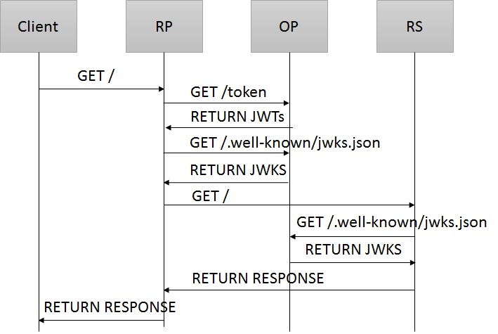

# oidc-gateway
This repository contains an example of using OpenID Connect based authentication in a reverse proxy for protecting web applications. 

## Authenticating Proxy vs No Proxy
Use of proxy may help implementing "single logout", if any of following statements is true:
* OP may initiate logout, but OP does not have network access to application servers
* login state is required to be shared on multiple application servers without prompts from OP

Use of proxy may help migration to OpenID Connect, if any following statements is true:
* applications are running inside Java EE container, which provides minimal or no OpenID Connect support

## Note
This code has been written to study OpenID Connect protocol. This should not be used in production

## Components
* identity-gateway - OpenID Connect relying party (RP)
* liberty-openid - Sample OpenID Connect resource server (RS) for testing purposes
* test-provider - Sample OpenID Connect provider (OP) for testing purposes

## Flows

### Authentication
Authentication flow is used when token reference cookie is not present, is not valid or when refresh token has been expired (or revoked).

1. Client requests resource from RP
2. RP redirects client to OP for authentication. A state is created and stored in a cookie. A state reference and a callback resource address are passed as request parameters in redirect address
3. Client requests authentication from OP. The state reference is stored
4. OP responses with a login form containing the state reference 
5. Client posts login form contents to OP
6. OP redirects client to the callback address. The state reference and a authentication code are passed as requests parameters
7. Client requests callback resource from RP with provided parameters and the state cookie
8. RP requests token from OP using the authentication code
9. OP returns a token set containing an id token, an access token and a refresh token
10. RP requests public keys from OP
11. OP returns public keys as JWKS
12. RP redirects client to location stored in the state. Tokens are stored on RP and a reference to tokens is stored in a cookie.
13. Client requests resource from RP with the token reference cookie
14. RP requests resource from RS with the referenced access token
15. RS requests public keys from OP
16. OP returns public keys as JWKS
17. RS returns response to RP
18. RP returns response to Client

### Token refresh
Token refresh flow is used when access token is about to expire or has been expired (or revoked). This flow is started when Client provides refresh cookie. Client may be redirected to authentication flow, if an error occurs during the flow. 

1. Client requests resource from RP with token reference cookie
2. RP requests token from OP with the refresh token stored earlier on RP
3. OP returns a token set containing an id token, an access token and a refresh token
4. RP requests public keys from OP
5. OP returns public keys as JWKS
6. RP requests resource from RS with the access token
7. RS requests public keys from OP
8. OP returns public keys as JWKS
9. RS returns response to RP
10. RP returns response to Client

### OP Initiated logout

### RS Initiated logout

